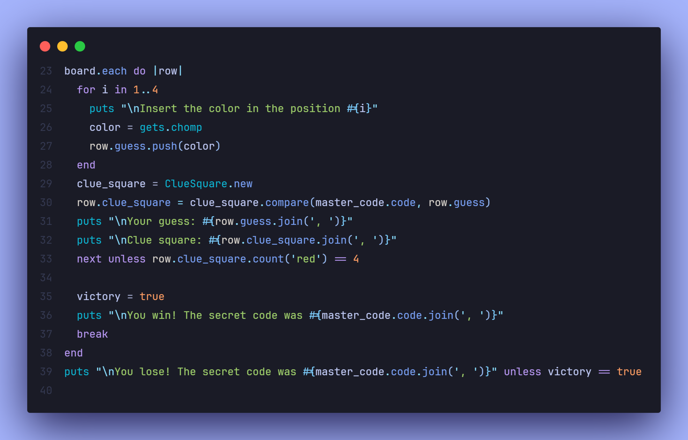

# 

 
 

Mastermind is a logic-based game where players must guess their opponent's secret code. In this version, you have 12 turns to guess a randomly generated color code, receiving feedback after each attempt. The computer will indicate which guesses are correct and in the right place or just the right color but misplaced.

This project is part of my journey through the Ruby course and has helped reinforce my understanding of object-oriented programming (OOP) concepts and command-line game design.

 Screenshots

  
    

    

## 📝 Project Objective

In this project, I built a command-line version of Mastermind where the player has 12 attempts to crack a secret color code generated by the computer. The primary challenge was to create a system that gives accurate feedback to the player after each guess, indicating which colors and positions were guessed correctly. In addition to the player guessing the computer’s random code, I implemented a second mode where the player becomes the code creator, and the computer must try to guess the player’s code.

When playing as the code creator, the computer uses a basic guessing strategy. It starts with random guesses and progressively improves its choices by keeping track of any correct color and position combinations. This added complexity of having the computer as a player required a strategic approach to make its guesses smarter after each round. The game follows the rules of Mastermind, but I also included a bit of flexibility by allowing the computer to retain correct guesses while refining its future ones.

Designing the project meant breaking down the game into distinct responsibilities. I built a MasterCode class to generate the secret code, a GuessRow class to store each guess and the clues provided, and a ClueSquare class to compare the player's guess with the secret code. The computer's guessing strategy was implemented in its own class, making the code easier to manage and extend.

Ultimately, this project was not only about recreating the Mastermind game but also about improving my ability to design programs with multiple interacting objects and implement game logic with strategic elements.

## 🔧 Features

- **Guesser Mode**: The human player guesses the code, and the game provides feedback each turn.

- **Creator Mode**: The player creates a secret code, and the computer tries to guess it within 12 turns, using a combination of random guesses and logic to improve its guesses over time.

- **Clue System**: Displays red and white clues based on correct guesses.

- **12 Turn Limit**: The game is limited to 12 turns for both guesser and creator modes.

## 📖 Learnings

- **Object-Oriented Programming (OOP)**: Designing a game using multiple classes, such as MasterCode, GuessRow, ClueSquare, and Computer, was essential for organizing the game logic and behavior.

- **Ruby Arrays and Hashes**: Handling guesses and comparing them to the code involved careful array manipulation.

- **Game Logic**: Implementing an algorithm for the computer to improve its guessing process in the "creator" mode, where it keeps track of correct guesses to refine its future guesses.

- **Code Refactoring**: Initially, I hardcoded many aspects of the game, but gradually refactored it to follow DRY (Don't Repeat Yourself) principles.

## 💻 Technologies Used

- **Ruby**: The entire project was written in Ruby, focusing on OOP principles.

## 💡 Acknowledgments

- **The Odin Project**: For providing the project outline and guidance.
